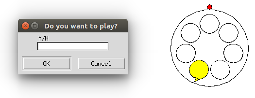

# GUI in Python
Graphic representation of program in Python

### Reference to:
[1] Valentyn N Sichkar. Graphic representation of program in Python // GitHub platform [Electronic resource]. URL: https://github.com/sichkar-valentyn/GUI_in_Python (date of access: XX.XX.XXXX)

## Description
Using PyCharm as IDE for Python here is the program which shows how to create program with _GUI_.
Program implements the game.

## GUI in Python

## MIT License
## Copyright (c) 2017 Valentyn N Sichkar
## github.com/sichkar-valentyn
### Reference to:
[1] Valentyn N Sichkar. Graphic representation of program in Python // GitHub platform [Electronic resource]. URL: https://github.com/sichkar-valentyn/GUI_in_Python (date of access: XX.XX.XXXX)
